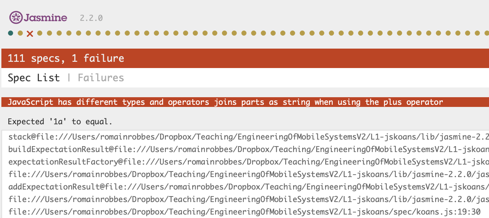

# JavaScript and ES6 Koans

These koans are adapted from the Javascript and ES6 koans in these two repositories:
- [https://github.com/ironhack/javascript-koans]
- [https://github.com/ironhack-labs/lab-es6-javascript-koans]


## What are the Koans?

[Koans](https://en.wikipedia.org/wiki/K%C5%8Dan) (公案) originate from Zen Buddhism, and are paradoxical riddles or stories used to test "students" on their path to enlightenment. They are designed to provoke thought or doubt in the student's mind. We are here to learn coding, so... what are the Koans?

The Koans are a series of assertions you must solve to understand how a programming language works. This is the first step to become a better developer. The Koans become increasingly more difficult as you continue, so don't feel discouraged as you move forward through them.

There are Koans for all the programming languages. We will work with JavaScript Koans. The mechanism is the following:

- You get an assertion that is not passing a **test**.
- You have to give the test the correct expected result to pass it.

We are going to test the code assertions with the [Jasmine](http://jasmine.github.io/) testing framework.


## Jasmine

To understand better what are the parts of the test in Jasmine, we will walk through an example. This is the first test we will find in our Koans:

```javascript
describe("JavaScript", function () {
  describe("has different types and operators", function() {
    it("considers numbers to be equal to their string representation", function() {
      expect(1 == "1").toBeTruthy();
      expect(1 != "1").toBeFalsy();
    });
  });
});
```

We will go through each different part of the test to explain all of them:

### describe

Describe used to group different tests on our code. This is very helpful when we see the tests results. In the code above, we have two different describes:

- The first `describe` groups **all** the tests for Javascript. 
- The second `describe` indicates us that we will test the different types and operators that JavaScript has.

As you can see, those are just information strings. When we execute our tests, they appear in the page grouping the different tests we have. This is very helpful when we have a lot of tests, to identify which tests are not passing.

### it

It receives a `string` that indicates what we are testing. It has to be a clear description about what we are going to do. In our example, we are testing that JavaScript considers the numbers to be equal to their string representation.

### expect

What we are expecting in the test. This function contains the expression we want to test. This expression has to coincide with the matcher of the test. If they agree, the test will pass. If they disagree, the test will fail.

### matcher

The matchers determine if a test will pass or not. The expression in the `expect` has to agree with the matcher. In our example, we are testing that JavaScript considers the numbers to be equal to their string representation. The matcher we selected is `.toBeTruthy()`.

So, the test `expect(1 == "1").toBeTruthy()` will pass. There is a huge list of matchers on testing, but we don't have to know all of them. The matchers we will use here are:

- `.toBeTruthy()` and `.toBeFalsy()`. We expect the expression to be truthy or falsy
- `.toEqual()`. We expect the expression to be equal than the value passed as a parameter, and it has also to be the same type: i.e. `expect(1).toBe(1)`
- `.toBe()`. We expect the expression to be equal than the value passed as a parameter, but not necessary the same type: i.e. `expect(1).toBe("1")`
- `not`. To negate the matcher.

We will see there are a lot of matchers we can use. Right now we just need the ones described above to do the Koans.


## Your task

- First fork and clone this repo into your Github account: `git clone https://github.com/rrobbes/EngineeringOfMobileSystems.git`.
- Then open the file `./lab1-jskoans/index.html` with your browser. The title of the page should be `Jasmine Test Runner`.
- You will see that all the tests are green, but most say `SPEC HAS NO EXPECTATIONS`. This is because the tests we have to implement are commented out.

All the tests are located inside the `spec` folder (`lab1-jskoans/spec/koans.js`). Open the `koans.js` file and uncomment the following line:

```javascript
 it("joins parts as string when using the plus operator", function() {
      // expect(1 + "a").toEqual(); // give the expected value as argument to toEqual()
    });
```

When we uncomment the line and refresh `index.html`, we will see an error message, similar to:



Your task is to make the test pass :-). You should:

- Uncomment the test
- Refresh the page to see that the uncommented test is failing
- Change the code to pass the test
- Refresh the page to see that the test is passing


This process has to be done for each test. **Do not uncomment all the tests and launch the app. It will be more difficult for you to see if your code is passing the tests.**

Some things to keep in mind:
- When changing the code, leave the `expect` lines unchanged! That would be cheating :-)
- If you refresh the page and see a message like `No specs found` on a grey background, you probably have a syntax error.
- You probably won't have time to finish everything today, but try to continue on your own time.
