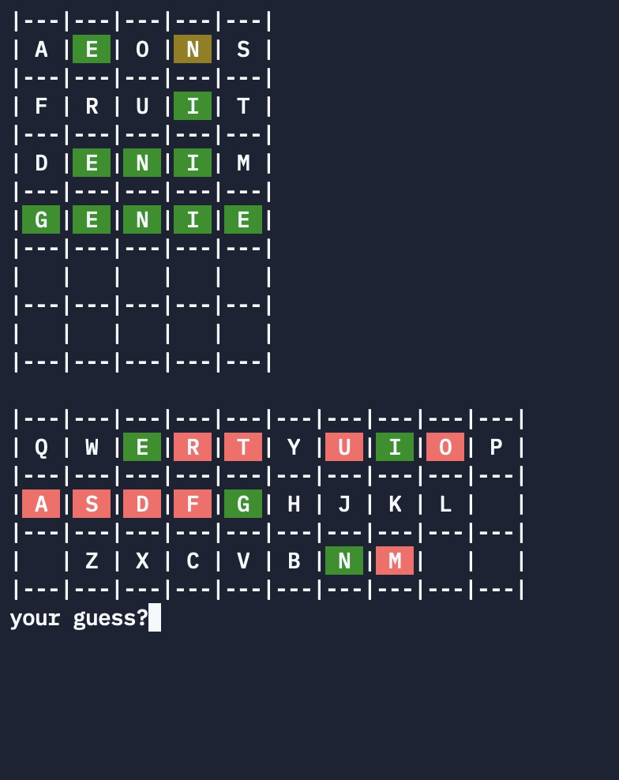

# Assignment 1: Wordle

The goal of this assignment is to implement a text-based version of the popular game Wordle. Wordle is a simple word guessing game developed by Josh Wardle, a software engineer. It was made public in October 2021, and became unexpectedly very popular. Due to its popularity, it was bought by the New York Times in January 2022 for a seven figure sum (!). 

In each game, a five letter word is chosen at random, and the player has to guess it in 6 attemps or less. Each letter of the guess is colored to give clues on the guess:

- A letter colored in **green** is part of the word to guess, and is correctly placed.
- A letter colored in **yellow** is part of the word to guess, but it not at the correct position. 
- A letter in **gray** is not present in the word.

**Repeating letters.** If a guess has repeating letters (e.g., "ROBOT"), a single one will be colored in green/yellow (the most correct match), unless the word also has multiple letters. For instance, if the word to guess is "ROOTS", both the Os will be colored (one in green and one in yellow). If the word to guess is "ROVER", only one O will be colored (the green one)

**Restrictions** One restriction of the game is that only existing words can be submitted as guesses. This avoids testing for arbitrary sequences of letters (e.g., finding the correct position of a letter by submitting a guess consisting only of that letter, such as "aaaaa"). Submitting an invalid word does not count as a guess. The game also has a "hard mode", where all green and yellow from the preceding guess must be used in the new guess. 

The game uses two lists of words:
- a list of valid words, which is on the order of 12,000 words.
- a list of words to guess, which is a subset of the valid words to avoid words that are too easy or too hard (ca 2000 words).

The game shows the list of guesses made, with the clues, as well as a "virtual keyboard", allowing players to see at a glance which letters they have tried or not.

The game can be played online:
- Once a day at the [new York Times](https://www.nytimes.com/games/wordle/index.html).
- Multiple times a day [here](https://www.wordleunlimited.com). 

# Goal of the assignment

The goal of the assignment is to implement a similar game, but using a console-based UI. 

At each turn, the program displays the list of guesses so far, and the "virtual keyboard". and waits for input from the player, such as this:

The game will have small differences with the original. First, it can be played multiple times a day. Second, if the input is a four-letter word, it is a command. The eligible commands are:

- QUIT: exit the game
- HELP: print the list of commands and their description
- HARD: restart a game, in hard mode
- EASY: restart a game, in normal mode
- STAT: print some statistics. After each game, the program records how many guesses you took to solve the game. These statistics are printed out with this command. The statistics are reset if you quit the game
- Any number: (e.g., 0042) restart a game, but set the word to guess to the word at this index in the word list. This is useful for testing purposes. 

# Important details

**Functional programming** Your project should, as much as possible, follow functional programming principes. Functions should be small, do one thing only, and should not modify their inputs. 
- Instead of changing an input, return an updated version of your input as the output of the function.  Remember that the spread operators in Javascript can be used to make copies of objects and lists, which will help you for this.
- An example of doing one thing only would be that instead of directly printing to the console, you should defined functions that format the data in the correct way, and define separate functions that actually print on the console. 

**Typescript** Your project should, as much as possible, use type annotations. At the very least, any data structure you define should have a type definition, and the functions you define should have type annotations for their arguments and return types.

**Grading** In addition to functionality, adherence to the guidelines above will be evaluated.

**Starter code** I have prepared an initial code base to get you over the initial hurdles. It contains:
- The two lists of words that are needed for the game to work.
- The necessary libraries for console input, output, and file input. No other packages are needed, beyond that standard library (e.g. )
- Examples of how to use input and output, including in colors

The starter code can be found, edited and executed on the website replit.com, at the following URL:

[WordleStarter](https://replit.com/@RomainRobbes/WordleStarter)

From there, you can execute the code (it will take a bit of time first since it might be loading some packages). You can also fork the repl from the same page (the blue button), and then edit it.

You can download the entire package and use it in your machine, if you want, but you should be able to do everything from the website (I did!). 

**Handing in the assignment** Hand in the assignment in Teams. The assignment should be a single source code file. The deadline for this is Sunday 10th of April at Midnight (in roughly 2 and a half weeks).

**Getting Help** Should you need help or be stuck, I will be available during the lectures and labs to assist you, starting next Monday. Start early, and do not hesitate to contact me!